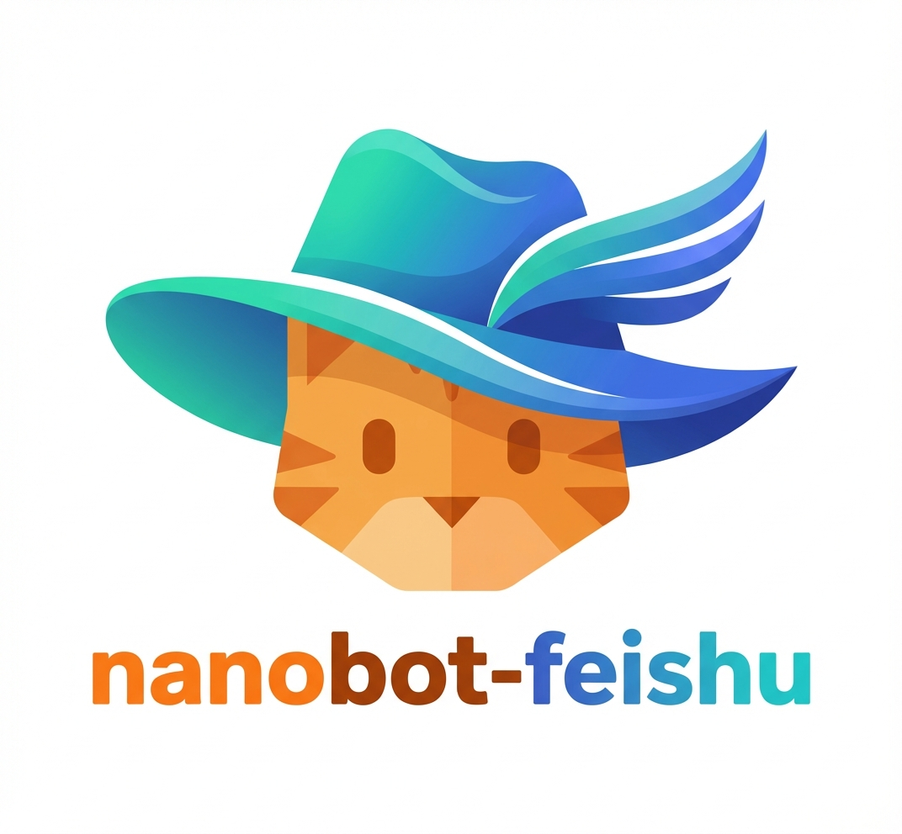

<div align="center">
  
</div>

# 🐈 nanobot-feishu: Feishu-Specialized nanobot Fork

A **Feishu-focused** fork of [nanobot](https://github.com/HKUDS/nanobot) — an ultra-lightweight personal AI assistant. This version extends nanobot with enhanced Feishu integration, new tools for PDF parsing, image generation, and session management, while refining the message delivery and context management mechanisms for a more reliable and feature-rich Feishu bot experience.

## 🌟 What's Changed

This fork introduces the following modifications on top of the original nanobot project:

### 1. New Tool: `parse_pdf_mineru`

A PDF parsing tool powered by the [MinerU](https://mineru.net) KIE HTTP API. It accepts a public PDF URL, submits it to the MinerU service for extraction, polls for completion, and returns the full Markdown content with metadata.

- Asynchronous polling with configurable timeout and interval
- Supports model version override (e.g. `vlm`)
- Downloads and extracts `full.md` from the result ZIP archive
- Configured via `tools.mineru` in `config.json`

### 2. New Tool: `image_generate`

An image generation tool that calls a model API (OpenAI-compatible endpoint) to generate or edit images, with optional direct delivery to Feishu.

- **Text-to-image**: Generate images from a text prompt
- **Image editing**: Accept single or multiple input images for editing tasks
- **Aspect ratio control**: Supports `1:1`, `16:9`, `original`, etc.
- **Feishu integration**: Optionally upload the generated image and send it as a rich post message to Feishu directly
- **Auto-save**: Saves output to `workspace/outputs/images/` by default
- Configured via `tools.image_gen` in `config.json`

### 3. New Tool: `session_manage`

A session management tool that enables the agent to programmatically create, switch, list, inspect, and reset conversation sessions.

- **`create`**: Create a new session with an auto-generated or custom title, optionally activate it immediately
- **`switch`**: Switch the active session to an existing one by key
- **`list`**: List all sessions with titles and timestamps
- **`current`**: Show the currently active session
- **`reset`**: Clear the active session override and fall back to the default channel session

This allows the agent to maintain multiple parallel conversation contexts per user/chat.

### 4. Enhanced Feishu Channel

The original Feishu channel implementation has been significantly upgraded:

- **Markdown-based messages**: Bot responses are now sent as rich-text **post** messages using Feishu's `md` tag, providing a more visually appealing and structured output
- **Image receiving**: The bot can receive image messages from users — images are automatically downloaded via the Feishu API and saved to a configurable media directory
- **Image sending**: Supports uploading and sending images as rich post messages with titles
- **File sending**: Supports uploading and sending files (PDF, DOCX, XLSX, PPTX, etc.) as file messages, with a 30MB size limit
- **Multi-media in a single message**: Text, images, and files can be combined in a single outbound message
- **Reaction feedback**: Automatically adds a thumbs-up reaction to received messages as a "seen" indicator

### 5. Transparent Tool-Call Notifications

The message pushing mechanism has been enhanced to provide visibility into the agent's reasoning process:

- When the agent invokes a tool, a **real-time notification** is pushed to the user showing the tool name and its parameters in a formatted code block
- Tool-call records are also written into the session history, giving the user a clear trace of agent behavior
- This makes the agent's actions fully transparent and easier to debug

### 6. Improved Session Context with Tool-Call History

The session management logic now **records tool-call actions into the conversation context**:

- Each tool invocation is saved as an assistant message (e.g., `🛠️Tool Call: web_search`) in the session history
- This prevents the agent from misjudging similar tasks — by seeing its own prior tool calls, it avoids erroneous tool selection or missed invocations
- Results in more consistent and reliable agent behavior across multi-turn conversations

---

## 🚀 Quick Start

### 1. Install

```bash
git clone https://github.com/Wuuu-uu/nanobot-feishu-specilized.git
cd nanobot-feishu-specilized
pip install -e .
```

For Feishu support, also install the Feishu SDK:

```bash
pip install lark-oapi
```

### 2. Initialize

```bash
nanobot onboard
```

### 3. Configure

Edit `~/.nanobot/config.json`:

```json
{
  "providers": {
    "openrouter": {
      "apiKey": "sk-or-v1-xxx"
    }
  },
  "agents": {
    "defaults": {
      "model": "anthropic/claude-opus-4-5"
    }
  },
  "channels": {
    "feishu": {
      "enabled": true,
      "appId": "cli_xxx",
      "appSecret": "xxx",
      "encryptKey": "",
      "verificationToken": "",
      "allowFrom": []
    }
  },
  "tools": {
    "web": {
      "search": {
        "apiKey": "",
        "maxResults": 5
      }
    },
    "exec": {
      "timeout": 60
    },
    "mineru": {
      "api_url": "https://mineru.net/api/v4/extract/task",
      "token": "",
      "model_version": "vlm",
      "timeout": 100
    },
    "image_gen": {
      "api_base": "",
      "api_key": "",
      "model_name": "gemini-3-pro-image-preview"
    },
    "restrictToWorkspace": false
  }
}
```

### 4. Set Up Feishu Bot

1. Visit [Feishu Open Platform](https://open.feishu.cn/app)
2. Create a new app → Enable **Bot** capability
3. **Permissions**: Add `im:message` (send messages), `im:message:send_as_bot`, `im:resource` (download images), `im:message:readonly` (receive messages), `im:message.p2p_msg:readonly` (receive private messages), `docs:document.content:read` (read cloud document content)
> **Note: ** As for multi-user senarios, you also need to add `contact:user.employee_id:readonly` to allow the bot to identify the user's Feishu ID.
4. **Events**: Subscribe to `im.message.receive_v1` (receive messages)
   - Select **Long Connection** (WebSocket) mode — no public IP required
5. Get **App ID** and **App Secret** from "Credentials & Basic Info"
6. Publish the app

### 5. Run

```bash
nanobot gateway
```

Or chat directly via CLI:

```bash
nanobot agent -m "Hello!"
```

---

## Configuration Reference

Config file: `~/.nanobot/config.json`

### 🔌 Providers

| Provider | Purpose | Get API Key |
|----------|---------|-------------|
| `openrouter` | LLM (recommended, access to all models) | [openrouter.ai](https://openrouter.ai) |
| `anthropic` | LLM (Claude direct) | [console.anthropic.com](https://console.anthropic.com) |
| `openai` | LLM (GPT direct) | [platform.openai.com](https://platform.openai.com) |
| `deepseek` | LLM (DeepSeek direct) | [platform.deepseek.com](https://platform.deepseek.com) |
| `groq` | LLM + Voice transcription (Whisper) | [console.groq.com](https://console.groq.com) |
| `gemini` | LLM (Gemini direct) | [aistudio.google.com](https://aistudio.google.com) |

### 🛠️ Tool-Specific API Keys

| Tool | Config Path | Required Keys |
|------|------------|---------------|
| Web Search | `tools.web.search` | `apiKey` ([Serper](https://serper.dev)) |
| MinerU PDF | `tools.mineru` | `token` ([MinerU](https://mineru.net)) |
| Image Generation | `tools.image_gen` | `apiBase`, `apiKey`, `modelName` |

### 📡 Feishu Channel

| Field | Description |
|-------|-------------|
| `appId` | App ID from Feishu Open Platform |
| `appSecret` | App Secret from Feishu Open Platform |
| `encryptKey` | Encrypt Key (optional for WebSocket mode) |
| `verificationToken` | Verification Token (optional for WebSocket mode) |
| `allowFrom` | Allowed user `open_id` list; empty = allow all |
| `mediaDir` | Directory to save received media (default: `~/.nanobot/media`) |

<details>
<summary><b>Full config example</b></summary>

```json
{
  "agents": {
    "defaults": {
      "workspace": "~/.nanobot/workspace",
      "model": "openai/Claude-Sonnet-4.5",
      "maxTokens": 10240,
      "temperature": 0.7,
      "maxToolIterations": 50
    }
  },
  "providers": {
    "openrouter": {
      "apiKey": "sk-or-v1-xxx"
    }
  },
  "channels": {
    "feishu": {
      "enabled": true,
      "appId": "cli_xxx",
      "appSecret": "xxx",
      "encryptKey": "",
      "verificationToken": "",
      "allowFrom": []
    }
  },
  "tools": {
    "web": {
      "search": {
        "apiKey": "",
        "maxResults": 5
      }
    },
    "exec": {
      "timeout": 60
    },
    "mineru": {
      "api_url": "https://mineru.net/api/v4/extract/task",
      "token": "",
      "model_version": "vlm",
      "timeout": 100
    },
    "image_gen": {
      "api_base": "",
      "api_key": "",
      "model_name": "gemini-3-pro-image-preview"
    },
    "restrictToWorkspace": false
  }
}
```

</details>

---

## CLI Reference

| Command | Description |
|---------|-------------|
| `nanobot onboard` | Initialize config & workspace |
| `nanobot agent -m "..."` | Chat with the agent |
| `nanobot agent` | Interactive chat mode |
| `nanobot gateway` | Start the gateway (Feishu bot) |
| `nanobot status` | Show status |
| `nanobot cron add` | Add a scheduled task |
| `nanobot cron list` | List scheduled tasks |
| `nanobot cron remove <id>` | Remove a scheduled task |

---

## 📁 Project Structure

```
nanobot/
├── agent/                # Core agent logic
│   ├── loop.py           #   Agent loop (LLM ↔ tool execution)
│   ├── context.py        #   Prompt & context builder
│   ├── memory.py         #   Persistent memory
│   ├── skills.py         #   Skills loader
│   ├── subagent.py       #   Background task execution
│   └── tools/            #   Built-in tools
│       ├── base.py       #     Tool base class
│       ├── registry.py   #     Dynamic tool registry
│       ├── filesystem.py #     File read/write/edit/list
│       ├── shell.py      #     Shell command execution
│       ├── web.py        #     Web search & fetch
│       ├── message.py    #     Message sending (text, image, file)
│       ├── pdf_mineru.py #     ★ PDF parsing via MinerU API
│       ├── image_generate.py # ★ Image generation & Feishu delivery
│       ├── session_manage.py # ★ Session create/switch/reset
│       ├── spawn.py      #     Subagent spawning
│       └── cron.py       #     Cron task management
├── channels/             # Chat channel integrations
│   ├── base.py           #   Base channel interface
│   ├── feishu.py         #   ★ Enhanced Feishu (markdown, image, file)
│   ├── telegram.py       #   Telegram
│   ├── discord.py        #   Discord
│   └── whatsapp.py       #   WhatsApp
├── session/              # Conversation session management
│   └── manager.py        #   ★ Session CRUD with active session tracking
├── bus/                  # Message routing (event bus)
├── cron/                 # Scheduled tasks
├── heartbeat/            # Proactive wake-up
├── providers/            # LLM providers (LiteLLM-based)
├── config/               # Configuration schema & loader
├── skills/               # Bundled skills (github, weather, tmux...)
├── cli/                  # CLI commands
└── utils/                # Helpers
```

> Items marked with ★ are new or significantly modified in this fork.

---

## Acknowledgements

This project is based on [nanobot](https://github.com/HKUDS/nanobot) by [HKUDS](https://github.com/HKUDS). Licensed under [MIT](./LICENSE).
